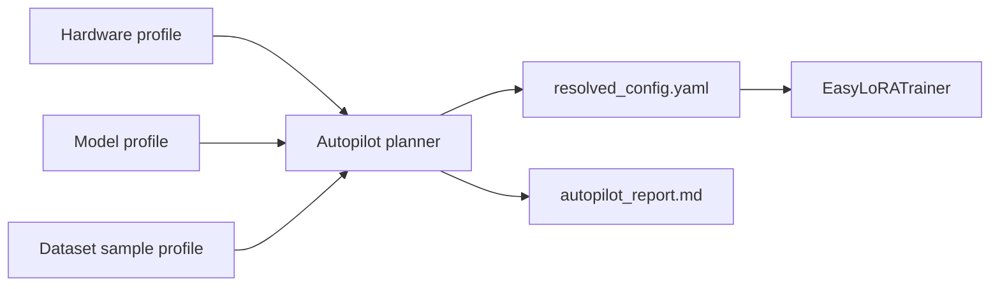

# Autopilot

Autopilot turns a model ID and dataset into a validated `TrainConfig`. It is
designed for safe first runs: inspect the plan, understand the tradeoffs, then
train with the same resolved settings.

```bash
easylora autopilot plan \
    --model meta-llama/Llama-3.2-1B \
    --dataset tatsu-lab/alpaca \
    --quality balanced \
    --save-report
```

## What Autopilot analyzes



- **Hardware**: CUDA/MPS availability, GPU name, VRAM, bf16/fp16 support, and
  bitsandbytes availability.
- **Model**: architecture, model type, context length, and estimated parameters.
- **Dataset**: sample count, inferred format, token length percentiles, and text
  field detection.
- **Quality preset**: `fast`, `balanced`, or `high`.

## Decisions

Autopilot chooses:

- LoRA vs QLoRA.
- Sequence length bucket.
- LoRA rank and alpha.
- Learning rate.
- Micro-batch size and gradient accumulation.
- Epochs or max steps.
- Save and logging cadence.

Every choice is written to `autopilot_report.json` and explained in
`autopilot_report.md`.

## Python API

```python
from easylora import autopilot_plan, save_autopilot_report

plan = autopilot_plan(
    model="meta-llama/Llama-3.2-1B",
    dataset="tatsu-lab/alpaca",
    quality="balanced",
)
print(plan.to_markdown())
save_autopilot_report(plan, "./output")
```

## Common warnings

- QLoRA selected but bitsandbytes is missing.
- QLoRA selected on non-CUDA hardware.
- Estimated VRAM exceeds detected GPU memory.
- Dataset examples exceed selected `max_seq_len` and will be truncated.

Warnings are not fatal by themselves. Treat them as prompts to lower the quality
preset, reduce sequence length, install `easylora[qlora]`, or move to a GPU with
more VRAM.
